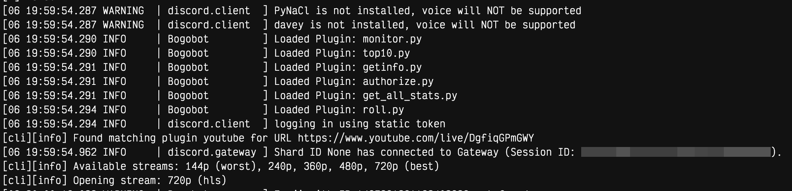

# Bogobot

Bogobot is a specialized Discord bot designed for monitoring the [24/7 Bogosort Livestream](https://www.youtube.com/live/DgfiqGPmGWY). The bot utilizes a hybrid of Optical Character Recognition (OCR) and YouTube Framework Metadata to provide high-accuracy statistics directly from the stream.

## Prerequisites

Python 3.10+ is required. The dependency scripts install the usual system tools:
Tesseract, FFmpeg, Streamlink, and the Python packages used by the bot.

## Installation

1. Clone the repository:
   ```bash
   git clone https://github.com/Msmastr74/Bogobot
   cd Bogobot
   ```
2. Run the dependency script for your environment:
   ```bash
   bash dependencies_android.sh   # For Android/Termux
   # OR
   bash dependencies_macos.sh  # For macOS with Homebrew
   # OR
   bash dependencies_windows.sh  # For Windows
   # OR
   bash dependencies_linux.sh  # For Linux
   ```
## Configuration
Go into `config.json` and provide the main credentials:
 * `bot_token`: Discord bot token.
 * `owner_uid`: Your Discord user ID.
 * `authorized_users`: User IDs allowed to run authorized commands.
 * `sync`: Set true when slash commands need to be synced.

If `local_config.json` exists, `main.py` uses that instead of `config.json`.
This is useful for local testing without changing the main config file.

## Execution
```bash
python main.py
```

For a simple server deployment, `harness.py` can run the bot and restart it
after fast-forward git pulls:

```bash
python harness.py
```

In your terminal output, you should see this:


## Features
Bogobot implements several slash commands for stream management and data retrieval:
 * /get_stats: Retrieves current shuffles, comparisons, and calculated uptime.
 * /monitor: Initiates a persistent tracking system for stream serial numbers.
 * /stop: Stops monitor updates in the current channel.
 * /subscribe_milestones: Subscribes a channel to best-run milestone updates.
 * /roll: A random number generation utility.
 * /authorize: Manages user permissions.
## Documentation
For technical details regarding the internal API, OCR configuration, channel proxies, and plugin development, refer to `DOCS.md`.
